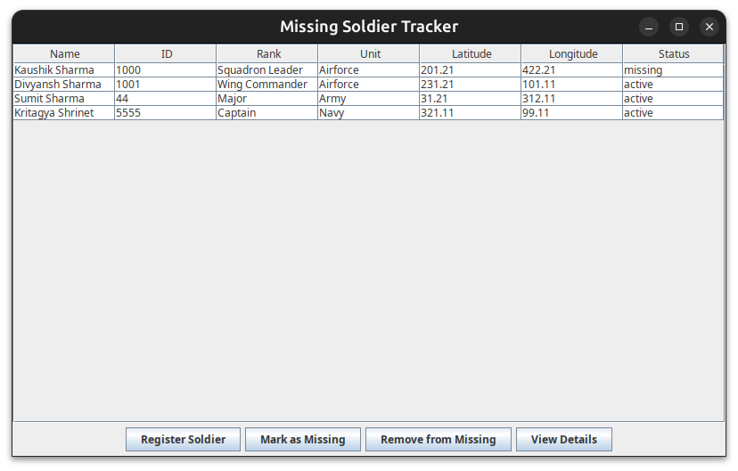
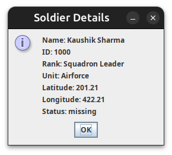
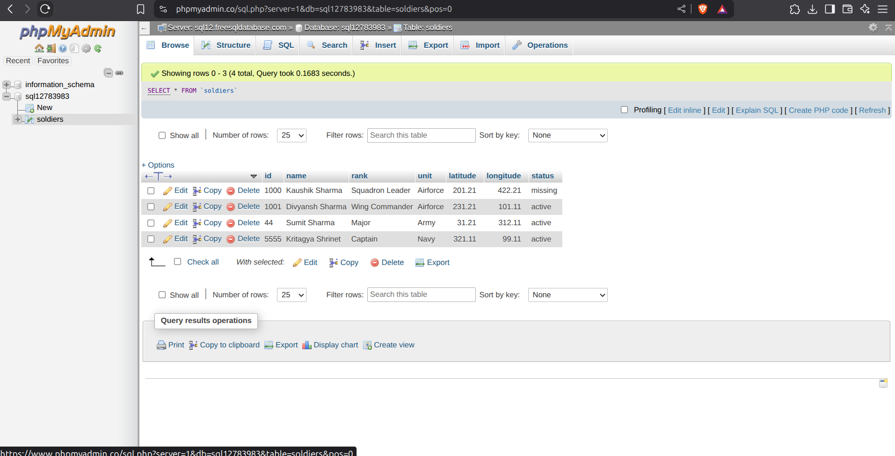

# Missing Soldier Tracker

This project is a Java Swing GUI application to track soldiers, with MySQL database integration for persistent storage. It allows users to register new soldiers, view their statuses, mark soldiers as missing, remove them from missing, and view full details of a specific soldier.

## Project Structure

```
MissingSoldierTracker-1/
├── src/
│   ├── Main.java
│   ├── MainGUI.java
│   ├── Soldier.java
│   ├── SoldierDatabase.java
├── lib/
│   └── mysql-connector-j-9.3.0.jar
├── Output/
│   ├── GUI.png
│   ├── Soldier_Details.png
│   └── Database_Storage_Admin.png
├── README.md
```

## Features

- **Register Soldiers**: Input soldier details such as name, soldier ID, rank, unit, latitude, and longitude.
- **View Soldiers**: Display a list of registered soldiers along with their current statuses.
- **Mark Soldier as Missing**: Mark a registered soldier as missing by their ID.
- **Remove Soldier from Missing**: Change a missing soldier's status back to active.
- **View Full Details**: View all details of a specific soldier by their ID.
- **Persistent Storage**: All soldier data is stored in a MySQL database and loaded automatically on startup.

## Requirements

- Java Development Kit (JDK) 8 or higher
- MySQL database (with a table named `soldiers`)
- MySQL JDBC driver (e.g., `mysql-connector-j-9.3.0.jar` in the `lib/` folder)

## How to Run the Application

1. **Compile the Java files:**
   ```bash
   javac -cp "src:lib/mysql-connector-j-9.3.0.jar" src/*.java
   ```
2. **Run the application:**
   ```bash
   java -cp "src:lib/mysql-connector-j-9.3.0.jar" MainGUI
   ```

## Database Setup

- The application will automatically create the `soldiers` table if it does not exist.
- Update your MySQL credentials in `SoldierDatabase.java` if needed.

## Usage Instructions

- The GUI will display options to register, view, mark as missing, remove from missing, and view details of soldiers.
- All data is saved and loaded from the MySQL database.

## Screenshots

### Main GUI



### Soldier Details Dialog



### Database Admin Page



## Troubleshooting

- If you see `No suitable driver found for jdbc:mysql://...`, make sure you are running with the MySQL driver JAR in your classpath as shown above.
- If you use an IDE, add the JAR to your project dependencies/build path.

## Future Enhancements

- Export/import soldier data to/from files.
- Additional search and reporting features.
- Improved UI/UX.
